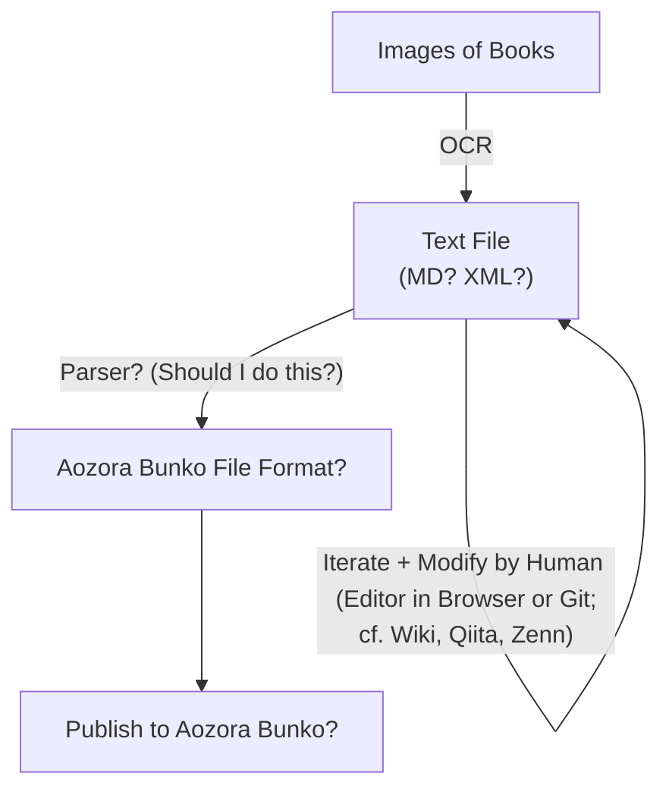

# shinonome-bunko / 東雲文庫

やがて夜は明ける．

## In my mind...🤔

## Related Projects
- [kyukyunyorituryo/AozoraEditor: 青空文庫エディタ](https://github.com/gearsns/AozoraJavaScriptParser)
- [kyukyunyorituryo/html2aozora](https://github.com/kyukyunyorituryo/html2aozora)
- [gearsns/AozoraJavaScriptParser](https://github.com/gearsns/AozoraJavaScriptParser)
