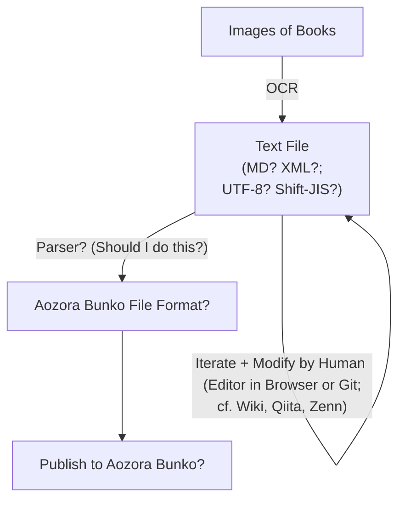

# shinonome-bunko / 東雲文庫

やがて夜は明ける．

## In my mind...🤔

## This Project consists of...

1. Text Recognition
   - OCR with Python
   - Aim to generate texts accurately and quickly even in Japanese vertical texts
1. Viewer/Editor
   - Simple and Fast Viewer and Editor working on Browser
   - Anyone can modify the generated texts either in Built-in Editor or GitHub (Can we compare the original pictures and the generated texts?)
   - Can this editor be built with Python as well?
1. Text Matching Game
   - Matching Game for Japanese Texts
   - Aim to improve the accuracy of OCR (also for fun, of course!)
   - This game can be a learning material for Japanese learners (like [the original concept of Duolingo](https://www.ted.com/talks/luis_von_ahn_massive_scale_online_collaboration))
   - cf. Google Captcha

## Related Projects
- [aozorahack](https://github.com/aozorahack)
- [kyukyunyorituryo/AozoraEditor: 青空文庫エディタ](https://github.com/gearsns/AozoraJavaScriptParser)
- [kyukyunyorituryo/html2aozora](https://github.com/kyukyunyorituryo/html2aozora)
- [gearsns/AozoraJavaScriptParser](https://github.com/gearsns/AozoraJavaScriptParser)
