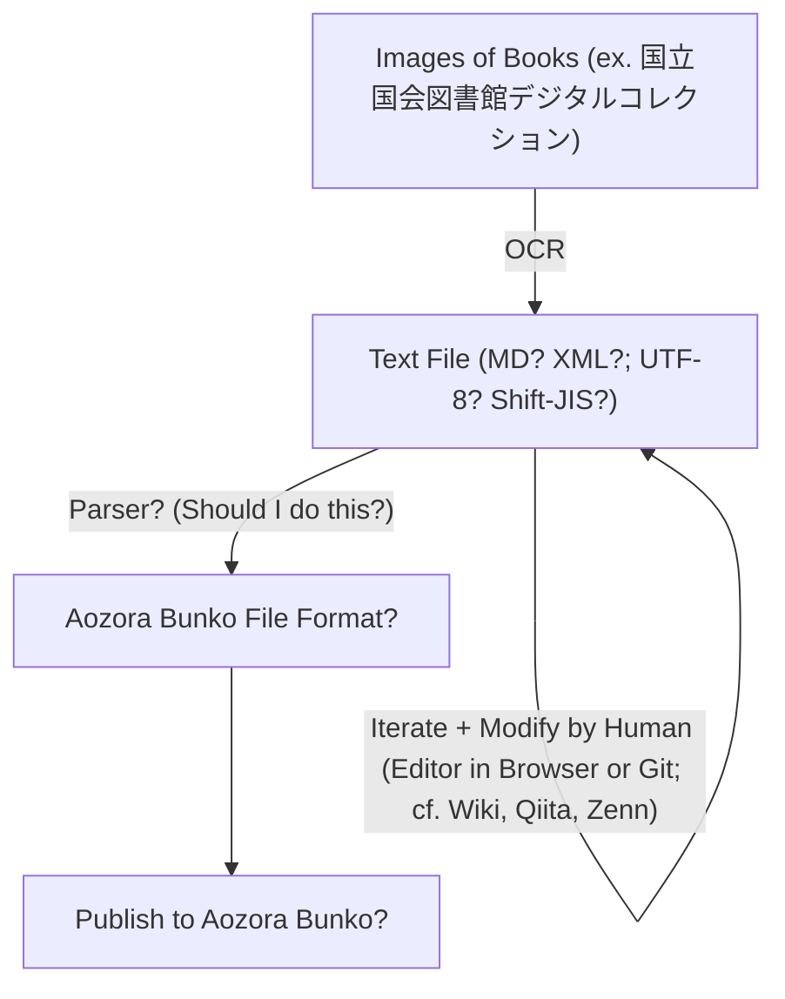

# shinonome-bunko / 東雲文庫

やがて夜は明ける．

## In my mind...🤔


```mermaid
graph TD
    A["Images of Books (ex. 国立国会図書館デジタルコレクション)"] -->|OCR| B
    B["Text File (MD? XML?; UTF-8? Shift-JIS?)"] -->|"Parser? (Should I do this?)"| C
    B --> |"Iterate + Modify by Human (Editor in Browser or Git; cf. Wiki, Qiita, Zenn)"| B
    C["Aozora Bunko File Format?"] -->| | D
    D["Publish to Aozora Bunko?"]
```

1. Use Existing Aozora Bunko Files as Training Data
   - We can find original texts since Aozora Bunko shows the original version of the texts ("底本").
   - Supervised learning with these data

## This Project consists of...

1. Text Recognition
   - OCR with Python
   - Aim to generate texts accurately and quickly also in Japanese vertical texts
1. Viewer/Editor
   - Simple and Fast Viewer and Editor working on Browser
   - Anyone can modify the generated texts either in the Built-in Editor or GitHub (Can we compare the original pictures and the generated texts?)
   - Can this editor be built with Python as well?
1. Text Matching Game
   - Matching Game for Japanese Texts
   - Aim to improve the accuracy of OCR (also for fun, of course!)
   - This game can be a learning material for Japanese learners (like [the original concept of Duolingo](https://www.ted.com/talks/luis_von_ahn_massive_scale_online_collaboration))
   - cf. Google Captcha

## Related Projects

- [aozorahack](https://github.com/aozorahack)
  - [Web Page](https://aozorahack.org)
  - [ideathon](https://github.com/aozorahack/ideathon): There are many ideas similar to this project!
  - [kosakuin](https://github.com/aozorahack/kosakuin): Aozora Bunko Editor (MIT License)
  - [aozora-cli](https://github.com/aozorahack/aozora-cli): Aozora Bunko CLI (MIT License)
  - [aozora-parser.js](https://github.com/aozorahack/aozora-parser.js)
  - [aozoraflow](https://github.com/aozorahack/aozoraflow)
- [kyukyunyorituryo/AozoraEditor: 青空文庫エディタ](https://github.com/kyukyunyorituryo/AozoraEditor)
- [kyukyunyorituryo/html2aozora](https://github.com/kyukyunyorituryo/html2aozora)
- [gearsns/AozoraJavaScriptParser](https://github.com/gearsns/AozoraJavaScriptParser)

---

This is a [Next.js](https://nextjs.org) project bootstrapped with [`create-next-app`](https://nextjs.org/docs/app/api-reference/cli/create-next-app).

## Getting Started

First, run the development server:

```bash
npm run dev
# or
yarn dev
# or
pnpm dev
# or
bun dev
```

Open [http://localhost:3000](http://localhost:3000) with your browser to see the result.

You can start editing the page by modifying `app/page.tsx`. The page auto-updates as you edit the file.

This project uses [`next/font`](https://nextjs.org/docs/app/building-your-application/optimizing/fonts) to automatically optimize and load [Geist](https://vercel.com/font), a new font family for Vercel.

## Learn More

To learn more about Next.js, take a look at the following resources:

- [Next.js Documentation](https://nextjs.org/docs) - learn about Next.js features and API.
- [Learn Next.js](https://nextjs.org/learn) - an interactive Next.js tutorial.

You can check out [the Next.js GitHub repository](https://github.com/vercel/next.js) - your feedback and contributions are welcome!

## Deploy on Vercel

The easiest way to deploy your Next.js app is to use the [Vercel Platform](https://vercel.com/new?utm_medium=default-template&filter=next.js&utm_source=create-next-app&utm_campaign=create-next-app-readme) from the creators of Next.js.

Check out our [Next.js deployment documentation](https://nextjs.org/docs/app/building-your-application/deploying) for more details.
