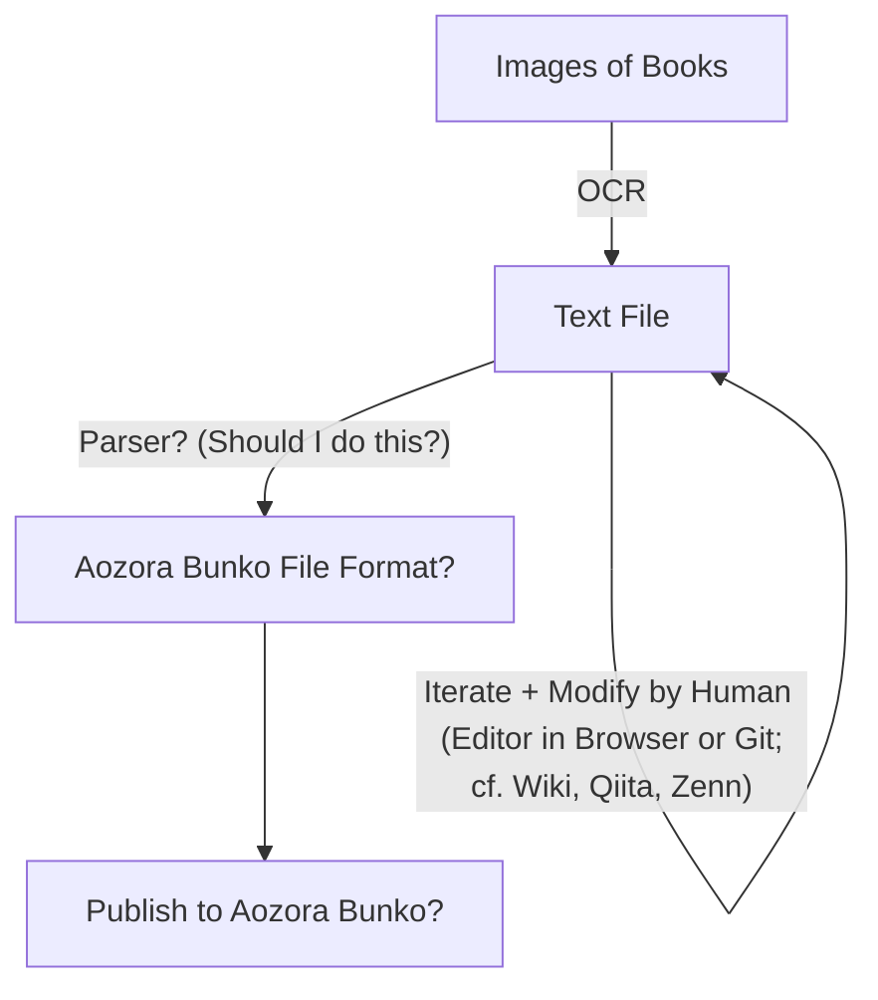

# shinonome-bunko / æ±é›²æ–‡åº«

ã‚„ãŒã¦å¤œã¯æ˜Žã‘る．

## In my mind...🤔

```mermaid
graph TD
    A[Images of Books] -->|OCR| B
    B[Text File] -->|"Parser? (Should I do this?)"| C
    B --> |"Iterate + Modify by Human \n (Editor in Browser or Git; cf. Wiki, Qiita, Zenn)"| B
    C["Aozora Bunko File Format?"] -->| | D
    D["Publish to Aozora Bunko?"]
```
